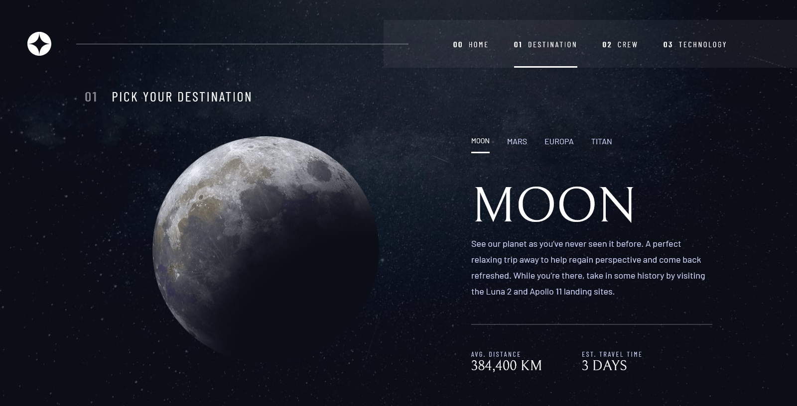

# Frontend Mentor - Space tourism website solution

This is a solution to the [Space tourism website challenge on Frontend Mentor](https://www.frontendmentor.io/challenges/space-tourism-multipage-website-gRWj1URZ3). Frontend Mentor challenges help you improve your coding skills by building realistic projects. 

## Table of contents

- [Overview](#overview)
  - [The challenge](#the-challenge)
  - [Screenshot](#screenshot)
  - [Links](#links)
- [My process](#my-process)
  - [Built with](#built-with)
  - [What I learned](#what-i-learned)
  - [Continued development](#continued-development)
  - [Useful resources](#useful-resources)
- [Author](#author)

## Overview

First of all, I'll excuse myself for my english since it's not my native language. My motivation to do this challenge was all the diferent things it had (different menus, responsive designs, dynamic data, etc).

I didn't comment any file, mainly because this was a one week project. Good luck to everyone trying to read that mess!

Also, the backdrop filter doesn't work in some browsers, I had to enable it manually on firefox and still it is somewhat buggy.

### The challenge

Users should be able to:

- View the optimal layout for each of the website's pages depending on their device's screen size
- See hover states for all interactive elements on the page
- View each page and be able to toggle between the tabs to see new information

### Screenshot





### Links

- Live Site URL: [Click here!](https://kbd813.neocities.org/final/assets/index.html)

## My process


My first approach was building all the shared css (main.css file), for someone like me who usually uses tailwind for styles it was extremely difficult, you just kind of assume classes exist when working with these kind of frameworks. I've always wanted to learn BEM so I tried to use it but it got really messy. I also tried to write my styles following a certain order but fixing bugs completely destroyed that order. 

After building the shared styles I made all the different menus, those were kind of easy since the only thing that changed was sizes, fonts and the hover/active states. I used after selectors to construct the hover and active states on all menus.

The next step was to try and make a shared layout for all the pages but it didn't work as I expected due to the different paddings and locations of elements between responsive designs.

I'm trying not to use divs and include some mains, articles, sections but it just doesn't seem to flow and I just end up adding div after div.

To end, I just did the individual styles and html structure for each page, initially I wanted to do static pages but I noticed there was a json file with all the data and decided to do dynamic buttons.

I built some simple js scripts that are in no way pretty or scalable but do the trick.

And that's all I hope you all liked my solution, if you want to ask something or give a suggestion/opinion feel free to reach out.

### Built with

- Semantic HTML5 markup
- CSS custom properties
- Flexbox
- CSS Grid
- JavaScript
- Mobile-first workflow

### What I learned

Some css tricks I'm proud of:

Adding an empty non-existent row at the end of the grid to distribute the remaining space and preveting the content from expanding across the screen, I used the same concept to build the page layout: auto height to the navbar and the rest to the content.
```css
  grid-template-rows: auto auto auto 1fr;
```

This is the navigation line in the desktop page.
```css
  .navigation__line{
    display: block;
    position: relative;
  }

  .navigation__line::after{
    z-index: 20;
    position: absolute;
    content: "";
    width: 100%;
    right: -50px;
    top: 50%;
    height: 1px;
    background-color: rgba(var(--color-3-r), var(--color-3-g), var(--color-3-b), 0.5);
  }
```

### Continued development

I'll keep working on my BEM skills and the order of my css to make it more readable.

### Useful resources

- [Hiding scrollbar](https://stackoverflow.com/questions/16670931/hide-scroll-bar-but-while-still-being-able-to-scroll) - If you didn't notice there is no scrollbar, I used one of the solutions proposed here.
- [Grid guide](https://css-tricks.com/snippets/css/complete-guide-grid/) - I kept forgetting the grid css attributes so this page helped me a lot to refresh my memory.

## Author

- Frontend Mentor - [@kbd813](https://www.frontendmentor.io/profile/kbd813)

